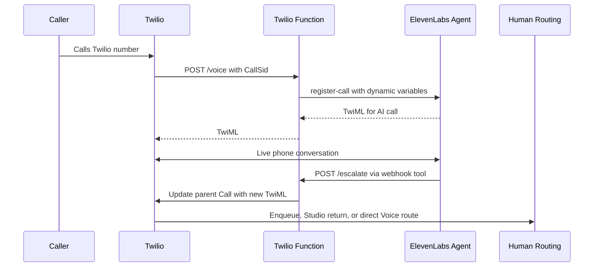

# Architecture

## Primary Handoff Path

The primary path is ElevenLabs `register-call` plus the custom `escalate_to_human` webhook tool. It is intentionally not an imported-number transfer: Twilio remains responsible for the inbound number, the original parent Call, and the final human-routing TwiML.

`parentCallSid` is the original inbound Twilio Call SID. The escalation handler must update that parent Call, never an ElevenLabs identifier or a child call leg. The ElevenLabs tool sends a concise `summary`, routing `intent`, `reason`, and an opaque `handoffId`; do not place PII in function paths, Studio query parameters, conference names, or logs.

## Routing Patterns

### Pattern A: Studio and Flex

Point the Twilio number at a Studio Flow. A TwiML Redirect widget calls `/studio_voice`, which registers the active call with ElevenLabs. The agent calls `/studio_escalate` when it needs a human. That endpoint updates the original parent Call with a redirect to the published Studio Flow webhook using `FlowEvent=return`, allowing the Flow to continue to Send to Flex.

### Pattern B: TaskRouter and Flex

Point the Twilio number Voice webhook at `/voice`, set `ROUTING_MODE=taskrouter`, and configure `FLEX_WORKFLOW_SID`. The agent tool calls `/escalate`, which updates the parent Call with `<Enqueue workflowSid="WW...">`. Task attributes use JSON-safe keys such as `reason`, `summary`, `intent`, `parentCallSid`, and `handoffId`; keys do not contain hyphens.

### Pattern C: Programmable Voice

Set `ROUTING_MODE=direct`, configure `DIRECT_TRANSFER_TO`, and call `/escalate` or `/direct_transfer`. With `DIRECT_TRANSFER_MODE=cold_dial`, Twilio dials the configured destination. With `DIRECT_TRANSFER_MODE=warm_conference`, Twilio places the caller in an opaque conference and calls the human destination with a concise warm-transfer summary. Conference names are derived from the parent Call SID and must not include PII.

## Alternate Native ElevenLabs Transfer Path

ElevenLabs' native Twilio integration supports the built-in `transfer_to_number` system tool. Use it when you want the fastest transfer to a phone number or SIP URI and do not need Twilio to own the handoff logic.

This blueprint does not use native transfer as the primary path because the register-call approach gives Twilio full control of Studio, Flex, TaskRouter, and Programmable Voice routing, while ElevenLabs-managed transfer is intentionally limited to the destinations configured inside ElevenLabs.

## Security Boundaries

- Inbound Twilio webhooks deployed on Twilio Functions must enable the platform's signature-validation access control. For local or non-Functions hosting, validate `X-Twilio-Signature` with the Twilio SDK.
- Every ElevenLabs tool call to `/escalate`, `/studio_escalate`, or `/direct_transfer` must send `Authorization: Bearer <HANDOFF_TOKEN>`.
- Keep the tool summary concise before it enters TaskRouter attributes, Studio query parameters, warm-transfer prompts, or logs.
