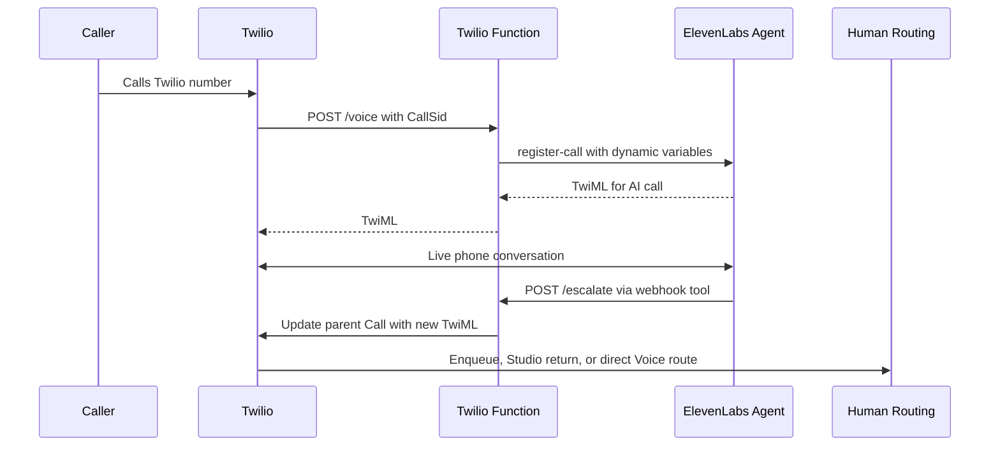

# ElevenLabs Twilio Handoff Blueprint Implementation Plan

> **For agentic workers:** REQUIRED SUB-SKILL: Use superpowers:subagent-driven-development (recommended) or superpowers:executing-plans to implement this plan task-by-task. Steps use checkbox (`- [ ]`) syntax for tracking.

**Goal:** Build a working Twilio + ElevenLabs blueprint that starts calls with an ElevenLabs voice agent and escalates the live caller to Flex, any TaskRouter-powered contact center, or a Programmable Voice destination.

**Architecture:** Twilio remains the call-control owner. The inbound Twilio webhook calls ElevenLabs' register-call API, passing the original Twilio `CallSid` and handoff metadata as ElevenLabs dynamic variables. The ElevenLabs agent uses a webhook tool named `escalate_to_human`; that tool calls a protected Twilio Function, which updates the original Twilio Call resource with the next TwiML instruction.

**Tech Stack:** Twilio Programmable Voice, Twilio Functions Serverless, TaskRouter/Flex optional routing, Twilio Studio optional routing, ElevenLabs Agents register-call API, ElevenLabs webhook tools, Node.js CommonJS, Jest.

## Global Constraints

- Primary path must use ElevenLabs register-call, not imported-number transfer, so Twilio keeps full routing control.
- ElevenLabs native `transfer_to_number` can be documented as an alternate convenience path, but it must not be the primary architecture.
- The handoff endpoint must update the original inbound parent `CallSid`, not an ElevenLabs or child leg identifier.
- Twilio Functions deployed for inbound Twilio webhooks must enable the platform's signature-validation access control; local or non-Functions hosting must validate `X-Twilio-Signature` with the Twilio SDK.
- All ElevenLabs tool calls into Twilio Functions must require `Authorization: Bearer <HANDOFF_TOKEN>`.
- TaskRouter attributes must use JSON-safe keys without hyphens.
- Do not place PII in conference names, function paths, Studio query parameters, or logs.
- Keep summaries concise before passing them into TaskRouter, Studio query parameters, warm-transfer prompts, or logs.
- The Twilio number must be configured with an HTTPS Voice webhook and a Voice fallback webhook before production use.
- The ElevenLabs agent must use Twilio-compatible audio settings for register-call telephony: mu-law 8000 Hz input and output.

---

## Source Notes

- ElevenLabs register-call lets our server keep Twilio number ownership and return ElevenLabs-provided TwiML to Twilio.
- ElevenLabs says register-call does not include ElevenLabs-managed call transfer, which is why the blueprint uses a custom webhook tool plus Twilio Call updates.
- ElevenLabs dynamic variables can be injected into prompts and tool parameters, which is how `parentCallSid` and `handoffId` travel from Twilio to the escalation tool without asking the model to invent them.
- Twilio Call updates can redirect an in-progress call to new TwiML.
- Twilio `<Enqueue workflowSid="WW...">` creates TaskRouter work for a call and can include task attributes.
- Twilio Conference supports hold, mute, participant removal, and coaching; use it for warm direct Programmable Voice handoff.

## File Structure

- Create: `README.md`
  - Public blueprint overview, routing-pattern selection guide, setup summary, and test checklist.
- Create: `serverless/package.json`
  - Twilio Functions development dependencies, Jest test scripts, and deploy script.
- Create: `serverless/.env.example`
  - Required environment variables for ElevenLabs, Twilio, Flex/TaskRouter, Studio, and direct Programmable Voice handoff.
- Create: `serverless/functions/voice.js`
  - Direct inbound Twilio webhook. Registers the call with ElevenLabs and returns the ElevenLabs TwiML.
- Create: `serverless/functions/studio_voice.js`
  - Studio TwiML Redirect entrypoint. Registers the call with ElevenLabs and returns the ElevenLabs TwiML.
- Create: `serverless/functions/outbound.js`
  - Optional outbound-call webhook. Registers an outbound Twilio call with ElevenLabs.
- Create: `serverless/functions/escalate.js`
  - ElevenLabs webhook-tool target for direct TaskRouter/Flex or direct Programmable Voice handoff.
- Create: `serverless/functions/studio_escalate.js`
  - ElevenLabs webhook-tool target that returns a Studio execution from the AI leg to Studio.
- Create: `serverless/functions/direct_transfer.js`
  - TwiML generator for warm or cold Programmable Voice transfer destinations.
- Create: `serverless/functions/status.js`
  - Twilio status callback endpoint for call lifecycle logging.
- Create: `serverless/functions/health.js`
  - Simple deployment health check that verifies required environment categories.
- Create: `serverless/lib/auth.js`
  - Bearer token validation for ElevenLabs tool calls and optional Twilio signature validation for local/custom hosting.
- Create: `serverless/lib/config.js`
  - Environment parsing and validation.
- Create: `serverless/lib/elevenlabs.js`
  - Register-call request builder and HTTP client wrapper.
- Create: `serverless/lib/handoff.js`
  - Handoff payload validation and TwiML builders for TaskRouter, Studio, and direct Voice routes.
- Create: `serverless/lib/twilio-client.js`
  - Testable wrapper around Twilio REST client operations.
- Create: `serverless/test/auth.test.js`
  - Unit tests for webhook and bearer auth.
- Create: `serverless/test/elevenlabs.test.js`
  - Unit tests for register-call payloads and ElevenLabs error handling.
- Create: `serverless/test/handoff.test.js`
  - Unit tests for payload validation and generated TwiML.
- Create: `serverless/test/functions.test.js`
  - Handler-level tests for `/voice`, `/studio_voice`, `/escalate`, and `/studio_escalate`.
- Create: `elevenlabs/agent-prompt.md`
  - Exact agent instructions for when to call `escalate_to_human`.
- Create: `elevenlabs/escalate-to-human-tool.example.json`
  - Dashboard/API reference for the ElevenLabs webhook tool.
- Create: `studio/elevenlabs-flex-handoff-flow.example.json`
  - Studio Flow template equivalent to the LiveKit blueprint's Studio pattern.
- Create: `docs/architecture.md`
  - Sequence diagrams and explanation of the parent-call update pattern.
- Create: `docs/setup.md`
  - Full setup instructions for Twilio Functions, ElevenLabs agent settings, Twilio number webhooks, Flex/TaskRouter, Studio, and direct Voice.
- Create: `docs/testing.md`
  - Local, ngrok, Twilio Console, ElevenLabs dashboard, Flex, TaskRouter, and direct call test steps.

---

### Task 1: Serverless Project Scaffold

**Files:**
- Create: `serverless/package.json`
- Create: `serverless/.env.example`
- Create: `serverless/functions/health.js`
- Create: `serverless/lib/config.js`
- Test: `serverless/test/config.test.js`

**Interfaces:**
- Produces: `loadConfig(env: object): Config`
- Produces: `requireEnv(config: Config, keys: string[]): void`
- Produces: `health.handler(context, event, callback): void`

- [ ] **Step 1: Write the failing config tests**

```js
const { loadConfig, requireEnv } = require("../lib/config");

test("loadConfig normalizes routing mode defaults", () => {
  const config = loadConfig({
    ELEVENLABS_AGENT_ID: "agent_123",
    ELEVENLABS_API_KEY: "xi_test",
    HANDOFF_TOKEN: "secret",
    ROUTING_MODE: "",
  });

  expect(config.routingMode).toBe("taskrouter");
  expect(config.elevenlabsAgentId).toBe("agent_123");
});

test("requireEnv reports all missing keys", () => {
  const config = loadConfig({});

  expect(() => requireEnv(config, ["ELEVENLABS_AGENT_ID", "HANDOFF_TOKEN"]))
    .toThrow("Missing required environment variables: ELEVENLABS_AGENT_ID, HANDOFF_TOKEN");
});
```

- [ ] **Step 2: Run the tests and verify they fail**

Run: `cd serverless && npm test -- config.test.js`

Expected: FAIL because `serverless/package.json`, `serverless/lib/config.js`, and the test runner do not exist yet.

- [ ] **Step 3: Add the package file**

```json
{
  "name": "twilio-elevenlabs-handoff-blueprint",
  "version": "0.1.0",
  "private": true,
  "scripts": {
    "test": "jest --runInBand",
    "deploy": "twilio serverless:deploy --service-name \"$TWILIO_SERVERLESS_SERVICE_NAME\" --env .env --override-existing-project"
  },
  "dependencies": {
    "twilio": "^5.4.0"
  },
  "devDependencies": {
    "jest": "^29.7.0"
  },
  "jest": {
    "testEnvironment": "node",
    "testMatch": ["**/test/**/*.test.js"]
  }
}
```

- [ ] **Step 4: Add the environment template**

```text
TWILIO_SERVERLESS_SERVICE_NAME=elevenlabs-handoff-blueprint
TWILIO_ACCOUNT_SID=ACxxxxxxxxxxxxxxxxxxxxxxxxxxxxxxxx
TWILIO_AUTH_TOKEN=replace_with_twilio_auth_token
TWILIO_PHONE_NUMBER=+15551234567

ELEVENLABS_API_KEY=replace_with_xi_api_key
ELEVENLABS_AGENT_ID=agent_xxxxxxxxxxxxxxxxxxxxxxxx

HANDOFF_TOKEN=replace_with_long_random_token
ROUTING_MODE=taskrouter

FLEX_WORKFLOW_SID=WWxxxxxxxxxxxxxxxxxxxxxxxxxxxxxxxx
TASKROUTER_WAIT_URL=

STUDIO_FLOW_WEBHOOK_URL=https://webhooks.twilio.com/v1/Accounts/ACxxxxxxxxxxxxxxxxxxxxxxxxxxxxxxxx/Flows/FWxxxxxxxxxxxxxxxxxxxxxxxxxxxxxxxx

DIRECT_TRANSFER_MODE=warm_conference
DIRECT_TRANSFER_TO=+15557654321
DIRECT_TRANSFER_FROM=+15551234567
DIRECT_HOLD_URL=http://twimlets.com/holdmusic?Bucket=com.twilio.music.classical
```

- [ ] **Step 5: Implement `loadConfig` and `requireEnv`**

```js
function loadConfig(env) {
  return {
    twilioAccountSid: env.TWILIO_ACCOUNT_SID || env.ACCOUNT_SID || "",
    twilioAuthToken: env.TWILIO_AUTH_TOKEN || env.AUTH_TOKEN || "",
    twilioPhoneNumber: env.TWILIO_PHONE_NUMBER || "",
    elevenlabsApiKey: env.ELEVENLABS_API_KEY || "",
    elevenlabsAgentId: env.ELEVENLABS_AGENT_ID || "",
    handoffToken: env.HANDOFF_TOKEN || "",
    routingMode: env.ROUTING_MODE || "taskrouter",
    flexWorkflowSid: env.FLEX_WORKFLOW_SID || "",
    taskrouterWaitUrl: env.TASKROUTER_WAIT_URL || "",
    studioFlowWebhookUrl: env.STUDIO_FLOW_WEBHOOK_URL || "",
    directTransferMode: env.DIRECT_TRANSFER_MODE || "warm_conference",
    directTransferTo: env.DIRECT_TRANSFER_TO || "",
    directTransferFrom: env.DIRECT_TRANSFER_FROM || env.TWILIO_PHONE_NUMBER || "",
    directHoldUrl: env.DIRECT_HOLD_URL || "http://twimlets.com/holdmusic?Bucket=com.twilio.music.classical",
  };
}

const ENV_TO_CONFIG = {
  TWILIO_ACCOUNT_SID: "twilioAccountSid",
  TWILIO_AUTH_TOKEN: "twilioAuthToken",
  TWILIO_PHONE_NUMBER: "twilioPhoneNumber",
  ELEVENLABS_API_KEY: "elevenlabsApiKey",
  ELEVENLABS_AGENT_ID: "elevenlabsAgentId",
  HANDOFF_TOKEN: "handoffToken",
  FLEX_WORKFLOW_SID: "flexWorkflowSid",
  STUDIO_FLOW_WEBHOOK_URL: "studioFlowWebhookUrl",
  DIRECT_TRANSFER_TO: "directTransferTo",
};

function requireEnv(config, keys) {
  const missing = keys.filter((key) => !config[ENV_TO_CONFIG[key]]);
  if (missing.length > 0) {
    throw new Error(`Missing required environment variables: ${missing.join(", ")}`);
  }
}

module.exports = { loadConfig, requireEnv };
```

- [ ] **Step 6: Implement `health.js`**

```js
const { loadConfig } = require(Runtime.getFunctions()["lib/config"].path);

exports.handler = function handler(context, event, callback) {
  const config = loadConfig(context);
  callback(null, {
    ok: Boolean(config.elevenlabsAgentId && config.handoffToken),
    routingMode: config.routingMode,
    hasTaskrouter: Boolean(config.flexWorkflowSid),
    hasStudio: Boolean(config.studioFlowWebhookUrl),
    hasDirectTransfer: Boolean(config.directTransferTo),
  });
};
```

- [ ] **Step 7: Run the tests and verify they pass**

Run: `cd serverless && npm test -- config.test.js`

Expected: PASS.

- [ ] **Step 8: Commit**

```bash
git add serverless/package.json serverless/.env.example serverless/functions/health.js serverless/lib/config.js serverless/test/config.test.js
git commit -m "chore: scaffold Twilio serverless project"
```

---

### Task 2: Auth and Payload Helpers

**Files:**
- Create: `serverless/lib/auth.js`
- Create: `serverless/lib/handoff.js`
- Test: `serverless/test/auth.test.js`
- Test: `serverless/test/handoff.test.js`

**Interfaces:**
- Consumes: `loadConfig(env: object): Config`
- Produces: `validateBearerToken(headers: object, expectedToken: string): void`
- Produces: `validateTwilioRequest(authToken: string, signature: string, url: string, params: object): void`
- Produces: `normalizeHandoffPayload(input: object): HandoffPayload`
- Produces: `buildTaskAttributes(payload: HandoffPayload): object`

- [ ] **Step 1: Write failing auth tests**

```js
const { validateBearerToken } = require("../lib/auth");

test("validateBearerToken accepts the configured bearer token", () => {
  expect(() => validateBearerToken({ authorization: "Bearer abc123" }, "abc123")).not.toThrow();
});

test("validateBearerToken rejects missing or wrong tokens", () => {
  expect(() => validateBearerToken({}, "abc123")).toThrow("Unauthorized");
  expect(() => validateBearerToken({ authorization: "Bearer wrong" }, "abc123")).toThrow("Unauthorized");
});
```

- [ ] **Step 2: Write failing handoff tests**

```js
const { normalizeHandoffPayload, buildTaskAttributes } = require("../lib/handoff");

test("normalizeHandoffPayload validates parent CallSid and summary", () => {
  const payload = normalizeHandoffPayload({
    parentCallSid: "CA1234567890abcdef1234567890abcdef",
    handoffId: "handoff-1",
    intent: "account_access",
    summary: "Caller cannot sign in after requesting a new code.",
    reason: "explicit_request",
  });

  expect(payload.parentCallSid).toBe("CA1234567890abcdef1234567890abcdef");
  expect(payload.intent).toBe("account_access");
});

test("buildTaskAttributes uses TaskRouter-safe keys", () => {
  const attrs = buildTaskAttributes({
    parentCallSid: "CA1234567890abcdef1234567890abcdef",
    handoffId: "handoff-1",
    intent: "account_access",
    summary: "Caller cannot sign in.",
    reason: "explicit_request",
    from: "+15551230000",
    to: "+15551239999",
  });

  expect(attrs.reason).toBe("ai_escalation");
  expect(attrs.parentCallSid).toMatch(/^CA/);
  expect(Object.keys(attrs).every((key) => !key.includes("-"))).toBe(true);
});
```

- [ ] **Step 3: Run tests and verify they fail**

Run: `cd serverless && npm test -- auth.test.js handoff.test.js`

Expected: FAIL because the helper files do not exist.

- [ ] **Step 4: Implement bearer token validation**

```js
function validateBearerToken(headers, expectedToken) {
  const value = headers.authorization || headers.Authorization || "";
  if (!expectedToken || value !== `Bearer ${expectedToken}`) {
    throw new Error("Unauthorized");
  }
}

function validateTwilioRequest(authToken, signature, url, params) {
  const twilio = require("twilio");
  if (!twilio.validateRequest(authToken, signature, url, params)) {
    throw new Error("Invalid Twilio signature");
  }
}

module.exports = { validateBearerToken, validateTwilioRequest };
```

- [ ] **Step 5: Implement handoff payload normalization**

```js
const CALL_SID = /^CA[0-9a-fA-F]{32}$/;

function trimString(value, maxLength) {
  return String(value || "").trim().slice(0, maxLength);
}

function normalizeHandoffPayload(input) {
  const parentCallSid = trimString(input.parentCallSid || input.parent_call_sid, 34);
  if (!CALL_SID.test(parentCallSid)) {
    throw new Error("Invalid parentCallSid");
  }

  return {
    parentCallSid,
    handoffId: trimString(input.handoffId || input.handoff_id || parentCallSid, 80),
    intent: trimString(input.intent || "general_support", 80),
    reason: trimString(input.reason || "ai_escalation", 80),
    summary: trimString(input.summary, 900),
    description: trimString(input.description || input.summary, 900),
    from: trimString(input.from, 32),
    to: trimString(input.to, 32),
  };
}

function buildTaskAttributes(payload) {
  return {
    type: "inbound",
    reason: "ai_escalation",
    channelType: "voice",
    intent: payload.intent,
    escalationReason: payload.reason,
    summary: payload.summary,
    description: payload.description,
    parentCallSid: payload.parentCallSid,
    handoffId: payload.handoffId,
    from: payload.from,
    to: payload.to,
  };
}

module.exports = { normalizeHandoffPayload, buildTaskAttributes };
```

- [ ] **Step 6: Run tests and verify they pass**

Run: `cd serverless && npm test -- auth.test.js handoff.test.js`

Expected: PASS.

- [ ] **Step 7: Commit**

```bash
git add serverless/lib/auth.js serverless/lib/handoff.js serverless/test/auth.test.js serverless/test/handoff.test.js
git commit -m "feat: add handoff auth and payload helpers"
```

---

### Task 3: ElevenLabs Register-Call Entrypoints

**Files:**
- Create: `serverless/lib/elevenlabs.js`
- Create: `serverless/functions/voice.js`
- Create: `serverless/functions/studio_voice.js`
- Create: `serverless/functions/outbound.js`
- Test: `serverless/test/elevenlabs.test.js`
- Test: `serverless/test/functions-register-call.test.js`

**Interfaces:**
- Consumes: `loadConfig(env: object): Config`
- Consumes: Twilio Functions platform signature validation for deployed Twilio webhooks.
- Produces: `registerTwilioCall(config: Config, params: RegisterCallParams, fetchImpl?: Function): Promise<string>`
- Produces: `buildConversationClientData(event: object, mode: string): object`

- [ ] **Step 1: Write failing register-call tests**

```js
const { buildConversationClientData, registerTwilioCall } = require("../lib/elevenlabs");

test("buildConversationClientData includes handoff metadata as dynamic variables", () => {
  const data = buildConversationClientData({
    CallSid: "CA1234567890abcdef1234567890abcdef",
    From: "+15551230000",
    To: "+15551239999",
  }, "taskrouter");

  expect(data.dynamic_variables.parent_call_sid).toBe("CA1234567890abcdef1234567890abcdef");
  expect(data.dynamic_variables.handoff_id).toBe("CA1234567890abcdef1234567890abcdef");
  expect(data.dynamic_variables.routing_mode).toBe("taskrouter");
});

test("registerTwilioCall returns TwiML from ElevenLabs", async () => {
  const fetchImpl = jest.fn().mockResolvedValue({
    ok: true,
    text: async () => "<Response><Connect /></Response>",
  });

  const twiml = await registerTwilioCall({
    elevenlabsApiKey: "xi_test",
    elevenlabsAgentId: "agent_123",
  }, {
    fromNumber: "+15551230000",
    toNumber: "+15551239999",
    direction: "inbound",
    conversationInitiationClientData: { dynamic_variables: { parent_call_sid: "CA1234567890abcdef1234567890abcdef" } },
  }, fetchImpl);

  expect(twiml).toContain("<Response>");
  expect(fetchImpl.mock.calls[0][0]).toBe("https://api.elevenlabs.io/v1/convai/twilio/register-call");
});
```

- [ ] **Step 2: Run tests and verify they fail**

Run: `cd serverless && npm test -- elevenlabs.test.js`

Expected: FAIL because `serverless/lib/elevenlabs.js` does not exist.

- [ ] **Step 3: Implement the ElevenLabs request builder**

```js
function buildConversationClientData(event, routingMode) {
  const parentCallSid = event.CallSid;
  return {
    type: "conversation_initiation_client_data",
    dynamic_variables: {
      parent_call_sid: parentCallSid,
      handoff_id: event.HandoffId || parentCallSid,
      routing_mode: routingMode,
      caller_number: event.From || "",
      called_number: event.To || "",
    },
  };
}

async function registerTwilioCall(config, params, fetchImpl = fetch) {
  const response = await fetchImpl("https://api.elevenlabs.io/v1/convai/twilio/register-call", {
    method: "POST",
    headers: {
      "content-type": "application/json",
      "xi-api-key": config.elevenlabsApiKey,
    },
    body: JSON.stringify({
      agent_id: config.elevenlabsAgentId,
      from_number: params.fromNumber,
      to_number: params.toNumber,
      direction: params.direction,
      conversation_initiation_client_data: params.conversationInitiationClientData,
    }),
  });

  const body = await response.text();
  if (!response.ok) {
    throw new Error(`ElevenLabs register-call failed with ${response.status}: ${body.slice(0, 300)}`);
  }
  return body;
}

module.exports = { buildConversationClientData, registerTwilioCall };
```

- [ ] **Step 4: Implement `/voice`**

```js
const { loadConfig } = require(Runtime.getFunctions()["lib/config"].path);
const { buildConversationClientData, registerTwilioCall } = require(Runtime.getFunctions()["lib/elevenlabs"].path);

exports.handler = async function handler(context, event, callback) {
  try {
    const config = loadConfig(context);
    const twiml = await registerTwilioCall(config, {
      fromNumber: event.From,
      toNumber: event.To,
      direction: "inbound",
      conversationInitiationClientData: buildConversationClientData(event, config.routingMode),
    });
    callback(null, new Twilio.Response()
      .appendHeader("Content-Type", "application/xml")
      .setBody(twiml));
  } catch (error) {
    const response = new Twilio.twiml.VoiceResponse();
    response.say("We are sorry, but the voice assistant is unavailable. Please try again later.");
    callback(null, response);
  }
};
```

- [ ] **Step 5: Implement `/studio_voice`**

Use the same implementation as `/voice`, but force `routingMode` to `studio` when building dynamic variables:

```js
const data = buildConversationClientData(event, "studio");
```

- [ ] **Step 6: Implement `/outbound`**

Use the same implementation as `/voice`, but set `direction: "outbound"` and read Twilio's outbound webhook values from `event.From`, `event.To`, and `event.CallSid`.

- [ ] **Step 7: Write handler tests with mocked ElevenLabs**

```js
test("/voice returns ElevenLabs TwiML as XML", async () => {
  const callback = jest.fn();
  const context = {
    ELEVENLABS_AGENT_ID: "agent_123",
    ELEVENLABS_API_KEY: "xi_test",
    HANDOFF_TOKEN: "secret",
    ROUTING_MODE: "taskrouter",
  };
  const event = {
    CallSid: "CA1234567890abcdef1234567890abcdef",
    From: "+15551230000",
    To: "+15551239999",
  };

  await require("../functions/voice").handler(context, event, callback);

  expect(callback.mock.calls[0][1].toString()).toContain("<Response>");
});
```

- [ ] **Step 8: Run tests and verify they pass**

Run: `cd serverless && npm test -- elevenlabs.test.js functions-register-call.test.js`

Expected: PASS.

- [ ] **Step 9: Commit**

```bash
git add serverless/lib/elevenlabs.js serverless/functions/voice.js serverless/functions/studio_voice.js serverless/functions/outbound.js serverless/test/elevenlabs.test.js serverless/test/functions-register-call.test.js
git commit -m "feat: register Twilio calls with ElevenLabs"
```

---

### Task 4: TaskRouter and Flex Escalation

**Files:**
- Modify: `serverless/lib/handoff.js`
- Create: `serverless/lib/twilio-client.js`
- Create: `serverless/functions/escalate.js`
- Test: `serverless/test/escalate-taskrouter.test.js`

**Interfaces:**
- Consumes: `normalizeHandoffPayload(input: object): HandoffPayload`
- Consumes: `buildTaskAttributes(payload: HandoffPayload): object`
- Produces: `buildTaskrouterTwiML(config: Config, payload: HandoffPayload): string`
- Produces: `updateCallWithTwiML(client, callSid: string, twiml: string): Promise<void>`

- [ ] **Step 1: Write failing TaskRouter TwiML tests**

```js
const { buildTaskrouterTwiML } = require("../lib/handoff");

test("buildTaskrouterTwiML enqueues the call into the configured workflow", () => {
  const twiml = buildTaskrouterTwiML({
    flexWorkflowSid: "WW1234567890abcdef1234567890abcdef",
    taskrouterWaitUrl: "https://example.com/wait.xml",
  }, {
    parentCallSid: "CA1234567890abcdef1234567890abcdef",
    handoffId: "handoff-1",
    intent: "billing",
    reason: "explicit_request",
    summary: "Caller asked for billing help.",
    description: "Caller asked for billing help.",
    from: "+15551230000",
    to: "+15551239999",
  });

  expect(twiml).toContain('workflowSid="WW1234567890abcdef1234567890abcdef"');
  expect(twiml).toContain("Caller asked for billing help.");
  expect(twiml).toContain("<Task>");
});
```

- [ ] **Step 2: Run the test and verify it fails**

Run: `cd serverless && npm test -- escalate-taskrouter.test.js`

Expected: FAIL because `buildTaskrouterTwiML` does not exist.

- [ ] **Step 3: Implement TaskRouter TwiML generation**

```js
function buildTaskrouterTwiML(config, payload) {
  const { VoiceResponse } = require("twilio").twiml;
  if (!/^WW[0-9a-fA-F]{32}$/.test(config.flexWorkflowSid)) {
    throw new Error("FLEX_WORKFLOW_SID must be a TaskRouter Workflow SID starting with WW");
  }

  const response = new VoiceResponse();
  const enqueue = response.enqueue({
    workflowSid: config.flexWorkflowSid,
    waitUrl: config.taskrouterWaitUrl || undefined,
  });
  enqueue.task({}, JSON.stringify(buildTaskAttributes(payload)));
  return response.toString();
}
```

- [ ] **Step 4: Implement Twilio call update wrapper**

```js
function createTwilioClient(config) {
  const twilio = require("twilio");
  return twilio(config.twilioAccountSid, config.twilioAuthToken);
}

async function updateCallWithTwiML(client, callSid, twiml) {
  await client.calls(callSid).update({ twiml });
}

module.exports = { createTwilioClient, updateCallWithTwiML };
```

- [ ] **Step 5: Implement `/escalate` for TaskRouter mode**

```js
const { validateBearerToken } = require(Runtime.getFunctions()["lib/auth"].path);
const { loadConfig } = require(Runtime.getFunctions()["lib/config"].path);
const { normalizeHandoffPayload, buildTaskrouterTwiML } = require(Runtime.getFunctions()["lib/handoff"].path);
const { createTwilioClient, updateCallWithTwiML } = require(Runtime.getFunctions()["lib/twilio-client"].path);

exports.handler = async function handler(context, event, callback) {
  try {
    const config = loadConfig(context);
    validateBearerToken(context.request.headers, config.handoffToken);
    const payload = normalizeHandoffPayload(event);
    const twiml = buildTaskrouterTwiML(config, payload);
    await updateCallWithTwiML(createTwilioClient(config), payload.parentCallSid, twiml);
    callback(null, { ok: true, route: "taskrouter", handoffId: payload.handoffId });
  } catch (error) {
    callback(null, { ok: false, error: error.message });
  }
};
```

- [ ] **Step 6: Add a mocked handler test**

```js
test("/escalate updates parent call with Enqueue TwiML", async () => {
  const update = jest.fn().mockResolvedValue({});
  const client = { calls: () => ({ update }) };

  await updateCallWithTwiML(client, "CA1234567890abcdef1234567890abcdef", "<Response />");

  expect(update).toHaveBeenCalledWith({ twiml: "<Response />" });
});
```

- [ ] **Step 7: Run tests and verify they pass**

Run: `cd serverless && npm test -- handoff.test.js escalate-taskrouter.test.js`

Expected: PASS.

- [ ] **Step 8: Commit**

```bash
git add serverless/lib/handoff.js serverless/lib/twilio-client.js serverless/functions/escalate.js serverless/test/escalate-taskrouter.test.js
git commit -m "feat: escalate ElevenLabs calls to TaskRouter"
```

---

### Task 5: Studio Return Escalation

**Files:**
- Modify: `serverless/lib/handoff.js`
- Create: `serverless/functions/studio_escalate.js`
- Create: `studio/elevenlabs-flex-handoff-flow.example.json`
- Test: `serverless/test/escalate-studio.test.js`

**Interfaces:**
- Consumes: `normalizeHandoffPayload(input: object): HandoffPayload`
- Produces: `buildStudioReturnTwiML(config: Config, payload: HandoffPayload): string`

- [ ] **Step 1: Write failing Studio TwiML test**

```js
const { buildStudioReturnTwiML } = require("../lib/handoff");

test("buildStudioReturnTwiML redirects to Studio FlowEvent return", () => {
  const twiml = buildStudioReturnTwiML({
    studioFlowWebhookUrl: "https://webhooks.twilio.com/v1/Accounts/AC123/Flows/FW123",
  }, {
    parentCallSid: "CA1234567890abcdef1234567890abcdef",
    handoffId: "handoff-1",
    intent: "account_access",
    reason: "explicit_request",
    summary: "Caller needs a person.",
    description: "Caller needs a person.",
  });

  expect(twiml).toContain("FlowEvent=return");
  expect(twiml).toContain("intent=account_access");
  expect(twiml).toContain("parentCallSid=CA1234567890abcdef1234567890abcdef");
});
```

- [ ] **Step 2: Run the test and verify it fails**

Run: `cd serverless && npm test -- escalate-studio.test.js`

Expected: FAIL because `buildStudioReturnTwiML` does not exist.

- [ ] **Step 3: Implement Studio return TwiML**

```js
function buildStudioReturnTwiML(config, payload) {
  const { VoiceResponse } = require("twilio").twiml;
  if (!config.studioFlowWebhookUrl) {
    throw new Error("STUDIO_FLOW_WEBHOOK_URL is required for Studio escalation");
  }

  const url = new URL(config.studioFlowWebhookUrl);
  url.searchParams.set("FlowEvent", "return");
  url.searchParams.set("route", "flex");
  url.searchParams.set("intent", payload.intent);
  url.searchParams.set("summary", payload.summary);
  url.searchParams.set("description", payload.description);
  url.searchParams.set("parentCallSid", payload.parentCallSid);
  url.searchParams.set("handoffId", payload.handoffId);

  const response = new VoiceResponse();
  response.redirect({ method: "POST" }, url.toString());
  return response.toString();
}
```

- [ ] **Step 4: Implement `/studio_escalate`**

Use the same handler shape as `/escalate`, but call `buildStudioReturnTwiML(config, payload)` and return `{ ok: true, route: "studio", handoffId }`.

- [ ] **Step 5: Add the Studio Flow template**

The template must have this widget shape:

```text
Trigger: Incoming Call
  -> TwiML Redirect: redirect_to_elevenlabs
      return -> Send to Flex: send_to_flex_1
```

The Send to Flex widget must include these attributes:

```json
{
  "type": "inbound",
  "name": "{{trigger.call.From}}",
  "from": "{{trigger.call.From}}",
  "customerAddress": "{{trigger.call.From}}",
  "customerName": "{{trigger.call.From}}",
  "channelType": "voice",
  "reason": "ai_escalation",
  "intent": "{{widgets.redirect_to_elevenlabs.intent}}",
  "summary": "{{widgets.redirect_to_elevenlabs.summary}}",
  "description": "{{widgets.redirect_to_elevenlabs.description}}",
  "parentCallSid": "{{widgets.redirect_to_elevenlabs.parentCallSid}}",
  "handoffId": "{{widgets.redirect_to_elevenlabs.handoffId}}"
}
```

- [ ] **Step 6: Run tests and verify they pass**

Run: `cd serverless && npm test -- escalate-studio.test.js`

Expected: PASS.

- [ ] **Step 7: Commit**

```bash
git add serverless/lib/handoff.js serverless/functions/studio_escalate.js studio/elevenlabs-flex-handoff-flow.example.json serverless/test/escalate-studio.test.js
git commit -m "feat: return ElevenLabs escalations to Studio"
```

---

### Task 6: Direct Programmable Voice Handoff

**Files:**
- Create: `serverless/functions/direct_transfer.js`
- Modify: `serverless/functions/escalate.js`
- Modify: `serverless/lib/handoff.js`
- Test: `serverless/test/direct-transfer.test.js`

**Interfaces:**
- Consumes: `normalizeHandoffPayload(input: object): HandoffPayload`
- Produces: `buildColdDirectTwiML(config: Config): string`
- Produces: `buildCallerConferenceTwiML(config: Config, payload: HandoffPayload): string`
- Produces: `buildHumanWarmJoinTwiML(config: Config, payload: HandoffPayload): string`
- Produces: `createWarmTransferCall(client, config: Config, payload: HandoffPayload): Promise<void>`

- [ ] **Step 1: Write failing direct transfer tests**

```js
const {
  buildColdDirectTwiML,
  buildCallerConferenceTwiML,
  buildHumanWarmJoinTwiML,
} = require("../lib/handoff");

test("buildColdDirectTwiML dials the configured destination", () => {
  const twiml = buildColdDirectTwiML({ directTransferTo: "+15557654321" });
  expect(twiml).toContain("<Dial>+15557654321</Dial>");
});

test("warm transfer TwiML puts caller and human in same conference", () => {
  const payload = {
    handoffId: "handoff-1",
    summary: "Caller needs help resetting access.",
  };
  const callerTwiml = buildCallerConferenceTwiML({ directHoldUrl: "https://example.com/hold.xml" }, payload);
  const humanTwiml = buildHumanWarmJoinTwiML({}, payload);

  expect(callerTwiml).toContain("handoff-handoff-1");
  expect(humanTwiml).toContain("Caller needs help resetting access.");
  expect(humanTwiml).toContain("handoff-handoff-1");
});
```

- [ ] **Step 2: Run the tests and verify they fail**

Run: `cd serverless && npm test -- direct-transfer.test.js`

Expected: FAIL because the direct transfer builders do not exist.

- [ ] **Step 3: Implement cold direct transfer TwiML**

```js
function buildColdDirectTwiML(config) {
  const { VoiceResponse } = require("twilio").twiml;
  if (!config.directTransferTo) {
    throw new Error("DIRECT_TRANSFER_TO is required for direct transfer");
  }
  const response = new VoiceResponse();
  response.dial(config.directTransferTo);
  return response.toString();
}
```

- [ ] **Step 4: Implement warm conference TwiML**

```js
function safeConferenceName(handoffId) {
  return `handoff-${String(handoffId || "call").replace(/[^a-zA-Z0-9_ -]/g, "").slice(0, 64)}`;
}

function buildCallerConferenceTwiML(config, payload) {
  const { VoiceResponse } = require("twilio").twiml;
  const response = new VoiceResponse();
  response.say("I am connecting you to a specialist now.");
  const dial = response.dial();
  dial.conference({
    startConferenceOnEnter: true,
    endConferenceOnExit: true,
    waitUrl: config.directHoldUrl,
  }, safeConferenceName(payload.handoffId));
  return response.toString();
}

function buildHumanWarmJoinTwiML(config, payload) {
  const { VoiceResponse } = require("twilio").twiml;
  const response = new VoiceResponse();
  response.say(`Warm transfer summary. ${payload.summary}`);
  const dial = response.dial();
  dial.conference({
    startConferenceOnEnter: true,
    endConferenceOnExit: false,
  }, safeConferenceName(payload.handoffId));
  return response.toString();
}
```

- [ ] **Step 5: Implement `createWarmTransferCall`**

```js
async function createWarmTransferCall(client, config, payload) {
  await client.calls.create({
    to: config.directTransferTo,
    from: config.directTransferFrom,
    twiml: buildHumanWarmJoinTwiML(config, payload),
  });
}
```

- [ ] **Step 6: Update `/escalate` routing mode selection**

```js
if (config.routingMode === "direct" && config.directTransferMode === "cold_dial") {
  twiml = buildColdDirectTwiML(config, payload);
}

if (config.routingMode === "direct" && config.directTransferMode === "warm_conference") {
  twiml = buildCallerConferenceTwiML(config, payload);
  await createWarmTransferCall(client, config, payload);
}
```

- [ ] **Step 7: Run tests and verify they pass**

Run: `cd serverless && npm test -- direct-transfer.test.js`

Expected: PASS.

- [ ] **Step 8: Commit**

```bash
git add serverless/functions/direct_transfer.js serverless/functions/escalate.js serverless/lib/handoff.js serverless/test/direct-transfer.test.js
git commit -m "feat: add direct Programmable Voice handoff"
```

---

### Task 7: ElevenLabs Agent Configuration Artifacts

**Files:**
- Create: `elevenlabs/agent-prompt.md`
- Create: `elevenlabs/escalate-to-human-tool.example.json`
- Create: `docs/setup.md`

**Interfaces:**
- Consumes: dynamic variables `{{parent_call_sid}}`, `{{handoff_id}}`, `{{routing_mode}}`, `{{caller_number}}`, and `{{called_number}}`
- Produces: ElevenLabs webhook tool `escalate_to_human`

- [ ] **Step 1: Create the exact agent prompt**

```markdown
# Agent Prompt

You are a concise phone support agent. Help the caller resolve their request.

Escalate to a human when:
- The caller explicitly asks for a person, human, representative, manager, or agent.
- The caller has tried one practical self-service step and is still blocked.
- The caller reports a complex billing, legal, safety, account access, or compliance issue.
- You do not have enough reliable information to continue safely.

Before calling `escalate_to_human`, say one short sentence to the caller: "I am connecting you to a specialist now."

When calling `escalate_to_human`, provide:
- `parentCallSid`: use `{{parent_call_sid}}` exactly.
- `handoffId`: use `{{handoff_id}}` exactly.
- `routingMode`: use `{{routing_mode}}` exactly.
- `intent`: a snake_case category such as `account_access`, `billing`, `technical_support`, or `general_support`.
- `reason`: one of `explicit_request`, `complex_issue`, `safety_or_compliance`, or `automation_limit`.
- `summary`: one or two sentences with what the caller wants, what was tried, and what the human should do next.
- `from`: use `{{caller_number}}` exactly.
- `to`: use `{{called_number}}` exactly.

Do not ask the caller for internal IDs, call SIDs, handoff IDs, routing modes, or webhook details.
```

- [ ] **Step 2: Create the ElevenLabs webhook tool example**

```json
{
  "name": "escalate_to_human",
  "description": "Escalate the active phone call to a human agent using Twilio. Use this only when the caller needs a human or the automation cannot safely continue.",
  "api_schema": {
    "url": "https://{{system__env_handoff_host}}/escalate",
    "method": "POST",
    "request_headers": {
      "authorization": "Bearer {{secret__handoff_token}}",
      "content-type": "application/json"
    },
    "request_body_schema": {
      "type": "object",
      "properties": {
        "parentCallSid": { "type": "string", "value": "{{parent_call_sid}}" },
        "handoffId": { "type": "string", "value": "{{handoff_id}}" },
        "routingMode": { "type": "string", "value": "{{routing_mode}}" },
        "intent": { "type": "string", "description": "Snake_case routing intent." },
        "reason": { "type": "string", "description": "Escalation reason code." },
        "summary": { "type": "string", "description": "Concise handoff summary for the human." },
        "from": { "type": "string", "value": "{{caller_number}}" },
        "to": { "type": "string", "value": "{{called_number}}" }
      },
      "required": ["parentCallSid", "handoffId", "intent", "reason", "summary"]
    }
  }
}
```

- [ ] **Step 3: Document the dashboard setup**

Add this setup sequence to `docs/setup.md`:

```markdown
## ElevenLabs Agent Setup

1. Create or choose an ElevenLabs Conversational Agent.
2. Set Twilio-compatible audio formats for register-call telephony: mu-law 8000 Hz input and output.
3. Add dynamic variables named `parent_call_sid`, `handoff_id`, `routing_mode`, `caller_number`, and `called_number`.
4. Add a secret or environment variable for the deployed Twilio Functions host.
5. Add a secret for `HANDOFF_TOKEN`.
6. Create the webhook tool from `elevenlabs/escalate-to-human-tool.example.json`.
7. Attach the webhook tool to the agent through the current ElevenLabs `tool_ids` mechanism.
8. Paste the instructions from `elevenlabs/agent-prompt.md` into the agent prompt.
9. Use the ElevenLabs test console to confirm the tool receives the dynamic `parentCallSid` value before testing a real Twilio call.
```

- [ ] **Step 4: Commit**

```bash
git add elevenlabs/agent-prompt.md elevenlabs/escalate-to-human-tool.example.json docs/setup.md
git commit -m "docs: add ElevenLabs agent setup"
```

---

### Task 8: Documentation and Diagrams

**Files:**
- Create: `README.md`
- Create: `docs/architecture.md`
- Create: `docs/testing.md`
- Modify: `docs/setup.md`

**Interfaces:**
- Consumes: all implemented endpoint names and environment variables.
- Produces: user-facing blueprint equivalent to the LiveKit handoff README.

- [ ] **Step 1: Add the README overview**

```markdown
# Twilio ElevenLabs Call Handoff Blueprint

This repo is a working blueprint for handing an active phone call from an ElevenLabs voice agent back to Twilio, then routing the caller to a human through Flex, TaskRouter, or Programmable Voice.

The core pattern is:

1. Twilio receives the inbound call.
2. A Twilio Function registers the call with ElevenLabs.
3. The Function passes Twilio call metadata into ElevenLabs as dynamic variables.
4. The ElevenLabs agent calls `escalate_to_human` when a human is needed.
5. The protected Twilio Function updates the original parent Call with new TwiML.

Choose a routing pattern:

- Pattern A: Studio owns the journey and receives the call back through `FlowEvent=return`.
- Pattern B: TaskRouter/Flex receives the caller through `<Enqueue workflowSid="WW...">`.
- Pattern C: Programmable Voice dials or conferences a configured human destination.
```

- [ ] **Step 2: Add architecture sequence diagrams**



- [ ] **Step 3: Add testing instructions**

```markdown
## Local Tests

Run:

```bash
cd serverless
npm install
npm test
```

## End-to-End Pattern B Test

1. Deploy Twilio Functions.
2. Point the Twilio number Voice webhook to `/voice`.
3. Configure the ElevenLabs agent webhook tool to call `/escalate`.
4. Set `ROUTING_MODE=taskrouter`.
5. Call the Twilio number.
6. Ask for a human.
7. Confirm the original Call is updated with `<Enqueue>`.
8. Confirm Flex or your TaskRouter assignment callback receives task attributes with `reason=ai_escalation`, `summary`, `intent`, `parentCallSid`, and `handoffId`.
```

- [ ] **Step 4: Document the native ElevenLabs transfer alternative**

Add this section to `docs/architecture.md`:

```markdown
## Alternate Native ElevenLabs Transfer Path

ElevenLabs' native Twilio integration supports the built-in `transfer_to_number` system tool. Use it when you want the fastest transfer to a phone number or SIP URI and do not need Twilio to own the handoff logic.

This blueprint does not use native transfer as the primary path because the register-call approach gives Twilio full control of Studio, Flex, TaskRouter, and Programmable Voice routing, while ElevenLabs-managed transfer is intentionally limited to the destinations configured inside ElevenLabs.
```

- [ ] **Step 5: Commit**

```bash
git add README.md docs/architecture.md docs/testing.md docs/setup.md
git commit -m "docs: document ElevenLabs Twilio handoff blueprint"
```

---

### Task 9: End-to-End Verification

**Files:**
- Modify: `docs/testing.md`

**Interfaces:**
- Consumes: deployed Twilio Functions URL.
- Consumes: configured ElevenLabs agent.
- Produces: verified routing evidence for Pattern A, Pattern B, and Pattern C.

- [ ] **Step 1: Run local tests**

Run:

```bash
cd serverless
npm install
npm test
```

Expected: all Jest tests PASS.

- [ ] **Step 2: Deploy Twilio Functions**

Run:

```bash
cd serverless
cp .env.example .env
npm run deploy
```

Expected: deploy prints public URLs for `/voice`, `/studio_voice`, `/escalate`, `/studio_escalate`, `/health`, and `/status`.

- [ ] **Step 3: Verify health endpoint**

Run:

```bash
curl https://your-service-1234.twil.io/health
```

Expected response:

```json
{
  "ok": true,
  "routingMode": "taskrouter",
  "hasTaskrouter": true,
  "hasStudio": false,
  "hasDirectTransfer": false
}
```

- [ ] **Step 4: Verify ElevenLabs dynamic-variable delivery**

In the ElevenLabs dashboard test tool, force an `escalate_to_human` call with default dynamic-variable placeholder values:

```json
{
  "parentCallSid": "CA1234567890abcdef1234567890abcdef",
  "handoffId": "manual-test",
  "intent": "general_support",
  "reason": "explicit_request",
  "summary": "Manual dashboard test.",
  "from": "+15551230000",
  "to": "+15551239999"
}
```

Expected: `/escalate` returns `{ "ok": false }` in dashboard-only tests unless the CallSid is live, and server logs show the payload contained the expected `parentCallSid`.

- [ ] **Step 5: Verify Pattern B with TaskRouter/Flex**

1. Set `ROUTING_MODE=taskrouter`.
2. Set `FLEX_WORKFLOW_SID=WW...`.
3. Point the Twilio number Voice webhook to `/voice`.
4. Call the Twilio number.
5. Say: "I need a human."
6. Confirm the ElevenLabs agent says it is connecting a specialist.
7. Confirm the Call resource is updated with `<Enqueue>`.
8. Confirm a Flex or TaskRouter task arrives with `reason=ai_escalation`.

- [ ] **Step 6: Verify Pattern A with Studio**

1. Import or build the Studio Flow.
2. Set the TwiML Redirect widget URL to `/studio_voice`.
3. Set `STUDIO_FLOW_WEBHOOK_URL` to the published Flow webhook URL.
4. Configure the ElevenLabs tool URL to `/studio_escalate`.
5. Point the Twilio number Voice webhook to the Studio Flow.
6. Call the Twilio number and request a human.
7. Confirm Studio resumes through the TwiML Redirect `return` transition.
8. Confirm Send to Flex receives `summary`, `intent`, `parentCallSid`, and `handoffId`.

- [ ] **Step 7: Verify Pattern C with direct Programmable Voice**

1. Set `ROUTING_MODE=direct`.
2. Set `DIRECT_TRANSFER_MODE=warm_conference`.
3. Set `DIRECT_TRANSFER_TO` to a test agent phone.
4. Point the Twilio number Voice webhook to `/voice`.
5. Call the Twilio number and request a human.
6. Confirm the caller hears the connecting message and hold audio.
7. Confirm the human phone receives a call and hears the warm-transfer summary.
8. Confirm caller and human join the same conference.

- [ ] **Step 8: Update the testing notes with evidence**

Append this table to `docs/testing.md` after each verified run:

```markdown
| Date | Pattern | Result | Evidence |
| --- | --- | --- | --- |
| 2026-08-05 | TaskRouter | PASS | Flex task WT..., Call CA..., summary visible |
| 2026-08-05 | Studio | PASS | Studio execution FN..., SendToFlex task WT... |
| 2026-08-05 | Direct Voice | PASS | Conference CF..., agent call CA... |
```

- [ ] **Step 9: Commit**

```bash
git add docs/testing.md
git commit -m "test: record end-to-end handoff verification"
```

---

## Self-Review

**Spec coverage:** The plan covers Twilio + ElevenLabs integration, Flex routing, generic TaskRouter routing, Programmable Voice routing, parity with the LiveKit parent-call update pattern, ElevenLabs account setup, Twilio account setup, and test strategy.

**Placeholder scan:** The implementation paths use concrete filenames, endpoint names, environment variables, function names, payload shapes, tests, and command lines. Replace-only values are explicit credential placeholders in `.env.example`.

**Type consistency:** `parentCallSid`, `handoffId`, `intent`, `reason`, `summary`, `description`, `from`, and `to` are consistent across register-call dynamic variables, ElevenLabs tool config, Twilio Function payload validation, TaskRouter attributes, Studio query parameters, and direct Voice transfer.

## Execution Handoff

Plan complete and saved to `docs/superpowers/plans/2026-08-05-elevenlabs-twilio-handoff-blueprint.md`. Two execution options:

1. **Subagent-Driven (recommended)** - dispatch a fresh subagent per task, review between tasks, fast iteration.
2. **Inline Execution** - execute tasks in this session using executing-plans, batch execution with checkpoints.
